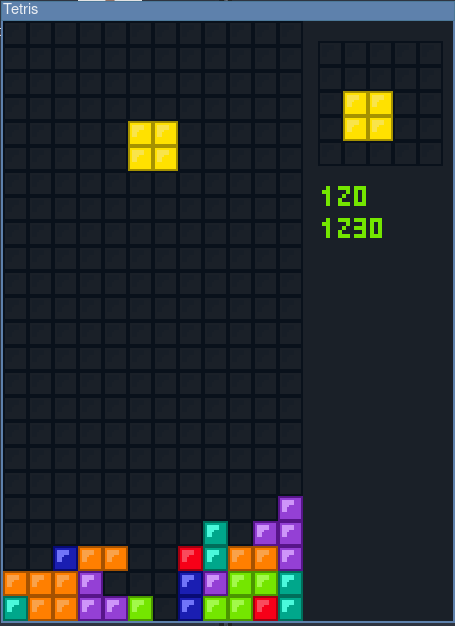
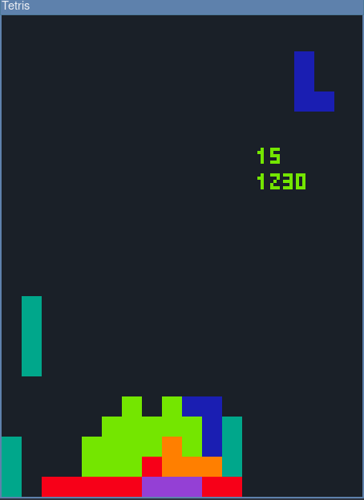

# Tetris
Simple tetris written in C++ using the SDL2 library

## Features:
- Scoring points;
- Saving the best results;
- Customization the interface in `setting.h`

## Screenshots:

_Default settings:_

_Minimalistic settings:_

